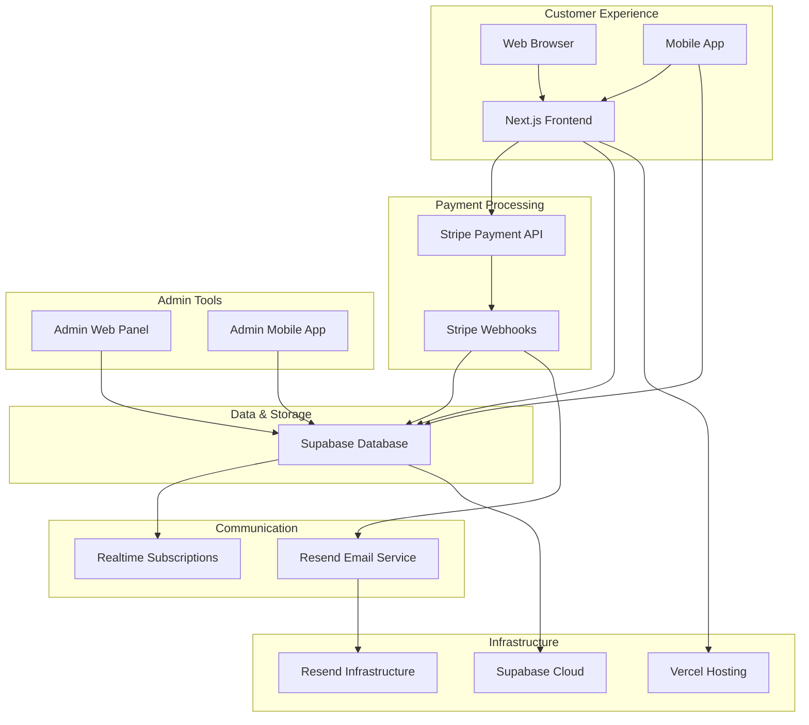
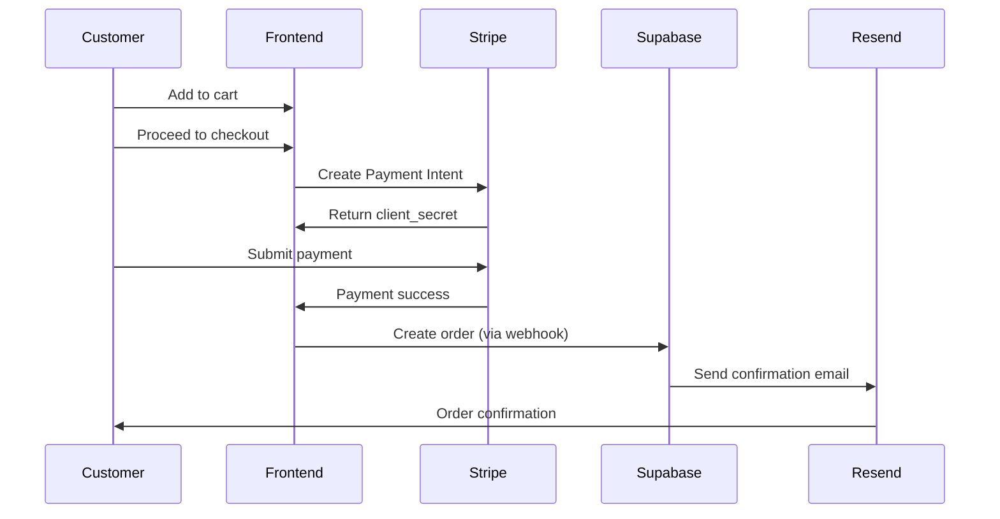
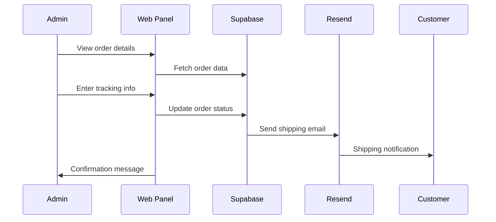
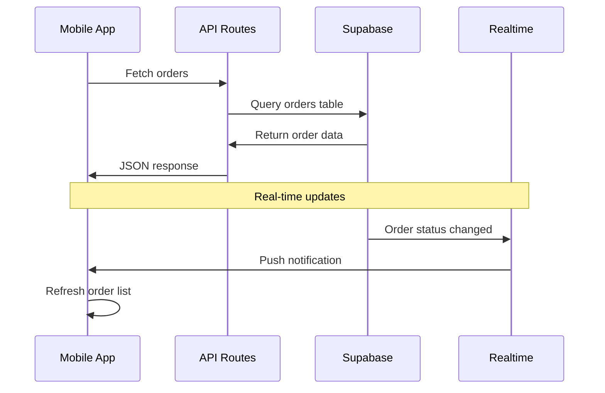
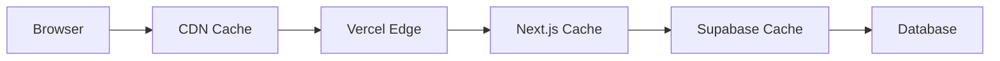
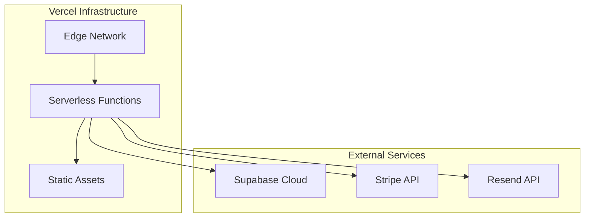

# SUPER Spec. — System Architecture

> Technical overview of how all components connect and interact.

---

## High-Level Architecture



---

## Component Breakdown

### Frontend (Next.js 15)
**Technology Stack:**
- **Framework:** Next.js 15 with App Router
- **Styling:** Tailwind CSS + custom CSS variables
- **UI Components:** Custom Prestige theme components
- **State Management:** React hooks + localStorage for cart
- **Authentication:** JWT tokens via Supabase Auth

**Key Features:**
- Server-side rendering (SSR) for SEO
- Client-side cart management
- Stripe Elements integration
- Real-time order updates via Supabase Realtime

**File Structure:**
```
app/
├── (auth)/          # Authentication pages
├── (shop)/          # Customer-facing pages
├── admin/           # Admin dashboard
├── api/             # API routes
└── globals.css      # Global styling
```

### Backend (Serverless Functions)
**API Routes:**
- `/api/checkout/*` - Payment processing
- `/api/admin/*` - Admin operations
- `/api/auth/*` - Authentication
- `/api/stripe/*` - Webhook handling

**Key Patterns:**
- Server-side validation for all inputs
- Idempotency checks for order creation
- Webhook signature verification
- Rate limiting on sensitive endpoints

### Database (Supabase)
**Schema Design:**
```sql
-- Core Tables
products           # Product catalog
product_variants   # Product options (size, color)
orders             # Customer orders
order_items        # Line items per order
users              # Customer accounts
discount_codes     # Promotional codes

-- Supporting Tables
newsletter_subscribers  # Email list
audit_log              # Admin actions
fulfillments           # Shipping tracking
```

**Security:**
- Row Level Security (RLS) on all tables
- JWT-based authentication
- Service role key for server operations
- Anonymous key for client access

### Payment System (Stripe)
**Integration Points:**
1. **Payment Elements** - Card, Apple Pay, Google Pay
2. **Express Checkout** - One-click payments
3. **Webhooks** - Order creation automation
4. **Connect** - Future marketplace features

**Flow:**
```
Customer Checkout → Stripe API → Payment Intent → 
Customer Pays → Webhook Trigger → Order Creation → Email Sent
```

### Email System (Resend)
**Templates:**
- Order confirmation (immediate)
- Shipping notification (on fulfillment)
- Password reset (auth flow)
- Newsletter subscriptions

**Configuration:**
- Domain: `orders@superspec.studio`
- DKIM/SPF records configured
- Template-based HTML emails
- Bounce handling built-in

---

## Data Flow Diagrams

### Customer Checkout Flow


### Admin Fulfillment Flow


### Mobile App Sync Flow


---

## Security Architecture

### Authentication Layers
1. **Customer Authentication**
   - Supabase Auth with email/password
   - JWT tokens stored in httpOnly cookies
   - Session management via middleware

2. **Admin Authentication**
   - Role-based access control
   - Separate admin user table
   - Elevated permissions for operations

3. **API Security**
   - Request validation with Zod schemas
   - Rate limiting on sensitive endpoints
   - CORS configuration for allowed origins

### Data Protection
- **Encryption:** All data encrypted in transit (TLS 1.3)
- **Storage:** Supabase handles encryption at rest
- **PII:** Customer data isolated by user ID
- **Audit Trail:** All admin actions logged

### Payment Security
- **PCI Compliance:** Stripe handles card data
- **Webhook Verification:** Signature validation
- **Idempotency:** Prevent duplicate orders
- **Tokenization:** No card details stored locally

---

## Performance Architecture

### Caching Strategy


**Cache Layers:**
1. **Browser Cache** - Static assets (1 week)
2. **CDN Cache** - Vercel Edge Network
3. **API Cache** - Product data (5 minutes)
4. **Database Cache** - Query results (Supabase)

### Optimization Techniques
- **Image Optimization** - Next.js Image component
- **Code Splitting** - Dynamic imports for admin
- **Lazy Loading** - Below-fold content
- **Bundle Analysis** - Regular size monitoring

### Monitoring & Analytics
- **Vercel Analytics** - Core Web Vitals
- **Supabase Logs** - Database performance
- **Stripe Monitoring** - Payment success rates
- **Custom Metrics** - Conversion tracking

---

## Deployment Architecture

### Production Environment


**Deployment Pipeline:**
```
Git Push → Vercel Build → Deploy to Edge → DNS Update → Live
```

### Environment Variables
**Client-Side:**
- `NEXT_PUBLIC_SUPABASE_URL`
- `NEXT_PUBLIC_SUPABASE_ANON_KEY`
- `NEXT_PUBLIC_STRIPE_PUBLISHABLE_KEY`

**Server-Side:**
- `SUPABASE_SERVICE_ROLE_KEY`
- `STRIPE_SECRET_KEY`
- `STRIPE_WEBHOOK_SECRET`
- `RESEND_API_KEY`
- `JWT_SECRET`

### Backup & Recovery
- **Database:** Daily automated backups (Supabase)
- **Code:** Git version control
- **Assets:** Vercel's immutable deployments
- **Configuration:** Environment variable exports

---

## Integration Details

### Stripe Integration
**Payment Methods:**
- Card payments (via Payment Element)
- Apple Pay (Express Checkout)
- Google Pay (Express Checkout)
- Link (saved cards)

**Webhook Events:**
- `payment_intent.succeeded` → Create order
- `payment_intent.payment_failed` → Handle failure
- `charge.refunded` → Update order status
- `checkout.session.completed` → Alternative flow

### Supabase Integration
**Realtime Subscriptions:**
- Order status updates
- Inventory changes
- Admin notifications
- Live order counts

**Storage Buckets:**
- `product-images` - Product photos
- `assets` - Theme assets
- `exports` - CSV exports

### Resend Integration
**Email Templates:**
- Order confirmation (`orderConfirmation.ts`)
- Shipping notification (`shippingNotification.ts`)
- Password reset (built-in)
- Newsletter (custom HTML)

**Domain Configuration:**
```
From: orders@superspec.studio
Reply-To: support@superspec.studio
SPF/DKIM: Configured via DNS
```

---

## Development Workflow

### Local Development
```bash
# Frontend
npm run dev          # Next.js dev server
npm run build        # Production build
npm run lint         # Code quality

# Mobile App
cd apps/admin-mobile
npx expo start       # Development server
npx expo run:ios     # iOS simulator
npx expo run:android # Android emulator
```

### Code Organization
```
src/
├── components/       # Reusable UI components
├── lib/             # Utility functions
├── types/           # TypeScript definitions
├── hooks/           # Custom React hooks
└── styles/          # CSS modules and variables
```

### Testing Strategy
- **Unit Tests:** Jest + React Testing Library
- **Integration Tests:** API route testing
- **E2E Tests:** Playwright for checkout flow
- **Visual Tests:** Storybook for components

---

## Scaling Considerations

### Horizontal Scaling
- **Frontend:** Vercel's global edge network
- **Database:** Supabase's connection pooling
- **Files:** Supabase Storage (CDN-backed)
- **Email:** Resend's distributed infrastructure

### Vertical Scaling
- **Compute:** Serverless functions auto-scale
- **Database:** Read replicas for heavy queries
- **Cache:** Redis for session storage
- **Queue:** Background job processing

### Future Enhancements
- **Marketplace:** Multi-vendor support
- **International:** Multi-currency, languages
- **Analytics:** Advanced business intelligence
- **AI:** Personalized recommendations

---

## Monitoring & Observability

### Key Metrics
- **Business:** Conversion rate, AOV, churn
- **Technical:** Page speed, error rate, uptime
- **User:** Session duration, bounce rate
- **Infrastructure:** Response times, resource usage

### Alerting
- **Critical:** Site down, payment failures
- **Warning:** High error rates, slow performance
- **Info:** New features deployed, metrics updated

### Logging Strategy
- **Structured Logs:** JSON format for parsing
- **Log Levels:** Error, warn, info, debug
- **Retention:** 30 days for detailed logs
- **Aggregation:** Daily summaries for trends

---

This architecture provides a solid foundation for a scalable e-commerce platform while maintaining simplicity and developer productivity. Each component is chosen for its specific strengths and integration capabilities.
